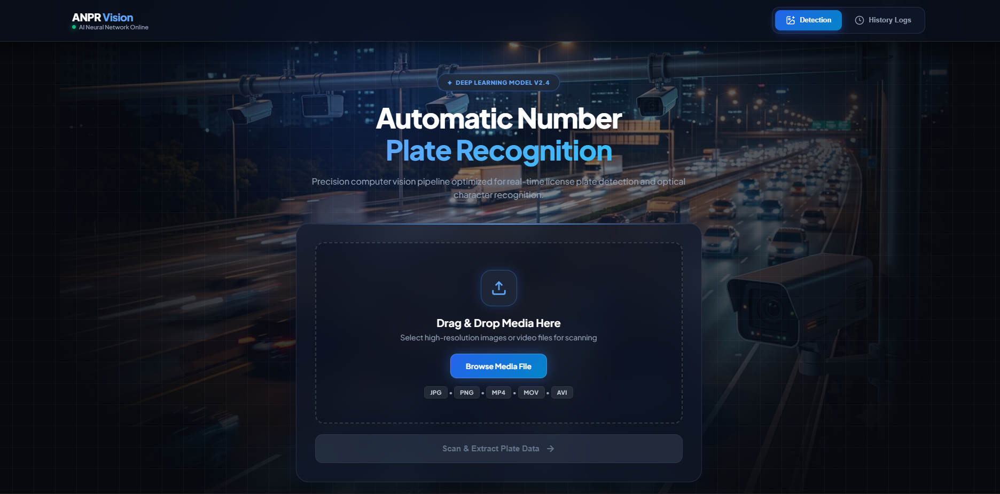
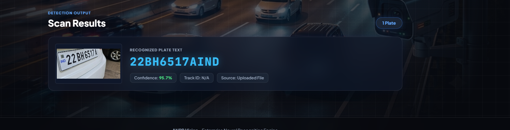
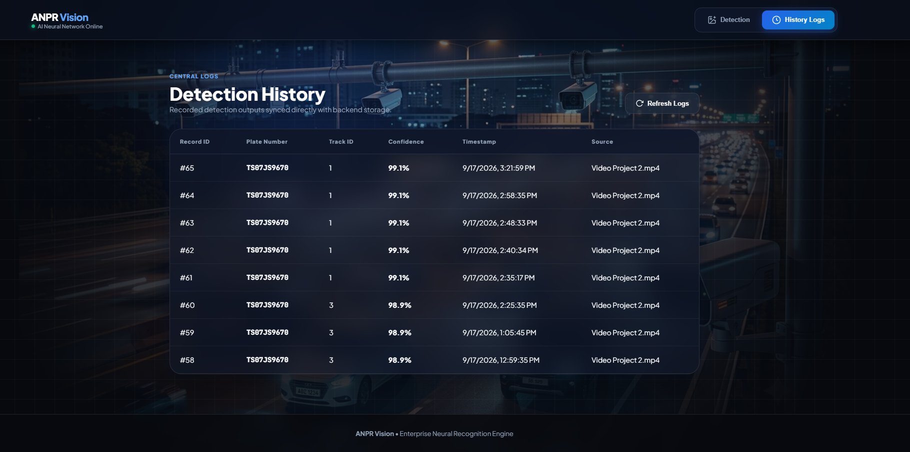

# 🚗 ANPR Web Application

Automatic Number Plate Recognition using YOLOv12 + PaddleOCR + FastAPI.

## 📌 Features

- 🖼️ **Image detection** — Upload an image and extract the license plate text
- 🎬 **Video detection** — Track vehicles and detect plates across video frames
- 📊 **History logs** — Store all detections in MySQL
- 🎨 **Modern glassmorphism UI**
- ✅ **Strict Indian number plate validation**
- ⚡ **Fast detection** — Optimized to perform 4 OCR calls per plate

## 🛠️ Tech Stack

- **Backend:** FastAPI, Python 3.13
- **ML:** YOLOv12 (Ultralytics), PaddleOCR
- **Database:** MySQL
- **Frontend:** HTML, CSS, JavaScript
- **Server:** Uvicorn

## 📸 Screenshots

### Detection Page

### Scan Results

### History Logs

## 📁 Project Structure

    ANPR-Web_Application/
    ├── app/
    │   ├── main.py
    │   ├── database.py
    │   ├── routers/
    │   │   ├── detect.py
    │   │   └── detections.py
    │   └── services/
    │       ├── detection.py
    │       └── video_detection.py
    ├── frontend/
    │   ├── index.html
    │   ├── style.css
    │   ├── app.js
    │   └── hero_image/
    ├── models/
    │   └── best.pt
    ├── data/
    │   └── crops/
    ├── requirements.txt
    └── README.md

## 🚀 Setup Instructions

### 1. Clone the Repository

    git clone https://github.com/Nazish-08/ANPR-Web_Application.git
    cd ANPR-Web_Application

### 2. Create Virtual Environment

#### Windows

    python -m venv venv
    venv\Scripts\activate

#### Linux / macOS

    python3 -m venv venv
    source venv/bin/activate

### 3. Install Dependencies

    pip install -r requirements.txt

### 4. Setup MySQL Database

Login to MySQL:

    mysql -u root -p

Create the database and table:

    CREATE DATABASE anpr_database;

    USE anpr_database;

    CREATE TABLE detections (
        id INT AUTO_INCREMENT PRIMARY KEY,
        plate_text VARCHAR(20) NOT NULL,
        track_id INT,
        confidence FLOAT,
        timestamp DATETIME,
        source VARCHAR(255)
    );

### 5. Update Database Credentials

Open:

    app/database.py

Update your MySQL credentials:

    DB_CONFIG = {
        "host": "localhost",
        "port": 3306,
        "user": "root",
        "password": "your_password_here",
        "database": "anpr_database",
    }

### 6. Run the Server

    uvicorn app.main:app --reload

### 7. Open in Browser

    http://localhost:8000

## 🎯 How to Use

### Image Detection

1. Open the **Detection** tab
2. Select an image in JPG or PNG format
3. Click **Scan & Extract Plate Data**
4. View the detected plate text and confidence score

### Video Detection

1. Open the **Detection** tab
2. Select a video in MP4, AVI, or MOV format
3. Click **Scan & Extract Plate Data**
4. Wait for the video to be processed
5. Unique detected plates will be displayed and stored in the database

> Example processing time: A 7-second video may take approximately 10–15 seconds depending on hardware and video resolution.

### History Logs

1. Open the **History Logs** tab
2. View previously detected number plates
3. Review plate text, confidence, track ID, timestamp, and source

## 🔄 Difference from Original Script

| Feature | Original Script | ANPR Web Application |
|---|---|---|
| Interface | Command line | Web UI with FastAPI |
| Image input | Local file path | HTTP file upload |
| Video input | Local file path | HTTP file upload |
| Results | Terminal output | Web UI + MySQL |
| History | None | MySQL history logs |
| Validation | Basic | Strict Indian plate format |
| OCR processing | 20 OCR calls per plate | 4 OCR calls per plate |
| Vehicle tracking | Script based | Integrated into web application |
| API | None | REST API |

## 🌐 API Endpoints

| Method | Endpoint | Description |
|---|---|---|
| POST | `/detect/image` | Upload and process an image |
| POST | `/detect/video` | Upload and process a video |
| GET | `/detections` | Retrieve all detections |
| GET | `/detections/{id}` | Retrieve a single detection |
| GET | `/health` | Check API health |
| GET | `/docs` | Open Swagger API documentation |

## 📡 API Documentation

After starting the server, open:

    http://localhost:8000/docs

FastAPI automatically provides interactive Swagger documentation for testing the API endpoints.

## ⚠️ Common Issues

### ModuleNotFoundError: No module named 'app'

Make sure the server is started from the project root directory.

    ANPR-Web_Application/

The `app/` folder must be located inside the project root.

Run:

    uvicorn app.main:app --reload

### MySQL Connection Error

Check the following:

- MySQL service is running
- MySQL username is correct
- MySQL password is correct
- Database `anpr_database` exists
- MySQL is running on port `3306`

### PaddleOCR Model Download Is Slow

PaddleOCR downloads its required models the first time it runs.

The initial download may take some time depending on your internet connection.

After the models are downloaded, they are cached locally and normally do not need to be downloaded again.

## 🔮 Future Improvements

- 🎥 Real-time video streaming using RTSP
- 🌍 Multi-language number plate support
- ☁️ Cloud deployment
- 🖥️ GPU acceleration
- 📦 Batch image and video processing
- 🔐 Authentication and user management
- 📈 Detection analytics dashboard
- 🚦 Real-time vehicle monitoring
- 📱 Improved mobile responsiveness

## 📄 License

MIT License — free to use, modify, and distribute.

## 👤 Author

**Nazish**

GitHub: [@Nazish-08](https://github.com/Nazish-08)

## ⭐ Support

If you found this project useful, consider giving the repository a ⭐ on GitHub.
